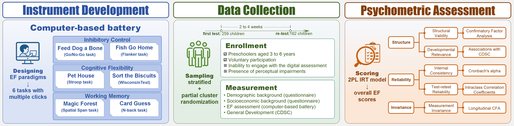

# Development and Evaluation of a Child-Friendly Computer-Based Battery Derived From Executive-Function Paradigms in Chinese Preschool Children

This repository contains the analytical code used to examine the psychometric properties of a newly developed **computer-based battery** designed to capture EF-related cognitive control in Chinese preschoolers aged 3–6 years.

## Project Overview
This project documents the exploratory analytical process for evaluating a a digital assessment battery adapted for young children. The repository includes code for the following analyses

- **Descriptive Statistics**: Analysis of baseline characteristics and performance distributions across different age groups.
- **Item Response Theory (IRT) Analysis**: Implementation of 2-Parameter Logistic (2PL) models for parameter estimation and task evaluation.
- **Psychometric Evaluation**：Assessment of the battery’s internal structure (CFA), internal consistency, and associations with general developmental status.
- **Stability and Invariance Testing**: Evaluation of test-retest reliability and measurement invariance across repeated assessments.

## Repository Structure
- **data/**: Data files and processing scripts
  - `Table_1_scale_characteristics.xlsx` - Scale variable descriptions
  - `Table_2_demo_characteristics.xlsx` - Demographic variable descriptions
  - `Table_3_task_characteristics.xlsx` - Game task variable descriptions
  - `Table_4_stimulated_game and scale data.csv` - Synthetic demographic, scale scores, and game performance data
  - `Table_5_stimulated_game_data.csv` - Synthetic game task-level performance records

- **codes/**: Main analysis scripts
  - `IRT.R` - core code
  
- **results/**: Analysis outputs (show an example)
  - `tables/` - Generated tables for publication
  - `figures/` - Generated figures for publication

- **README.md**: Project documentation

## Quick Start
```r
source("codes/IRT.R")
```

### Prerequisites

- R (version ≥ 4.3.2)
- Required R packages:

```r
install.packages(c(
  "openxlsx", "tidyverse", "compareGroups", "lavaan", 
  "semTools", "blandr", "ggplot2", "gridExtra", "purrr", 
  "ltm", "mice", "psych", "mirt", "scales"
))
```
